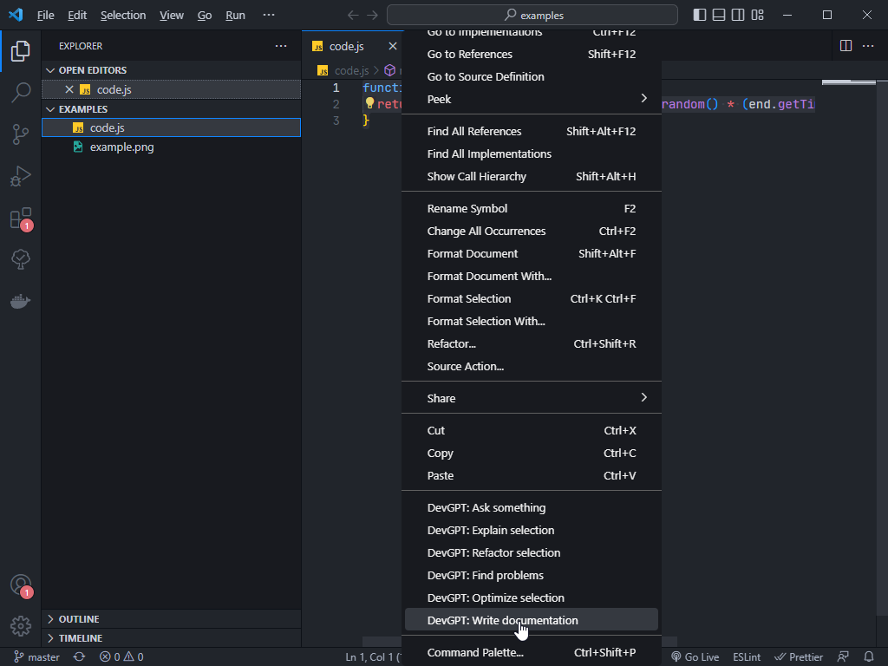

# GPT3 extension for VSCode (DevGPT)

This Visual Studio Code extension allows you to use the official OpenAI API to generate code or natural language answers from OpenAI ChatGPT to your questions right in the editor

- GPT-3 can improve efficiency by automating time-consuming tasks
- It can increase accuracy by suggesting corrections and improvements
- The AI can stimulate creativity by generating new ideas and approaches
- It is versatile and can work on a wide range of languages and projects
- It can handle larger and more complex projects more easily, increasing scalability
- Using GPT-3 can potentially lead to cost savings by automating certain tasks

### Links:

- **[Github](https://github.com/bogdanaks/devgpt)**

## Features

- Right click on a code selection and run one of the context menu **shortcuts**
- ask something
  - automatically write documentation for your code
  - explain the selected code
  - refactor or optimize it
  - find problems with it
- View DevGPT's responses in a new editor window

## Obtaining OpenAI API key

To use this extension, you will need an API key from OpenAI. To obtain one, follow these steps:

1. Go to [OpenAI's website](https://beta.openai.com/account/api-keys). If you don't have an account, you will need to create one or sign up using your Google or Microsoft account
2. Click on the `Create new secret key` button
3. Copy the key and paste it into cmd+shift+p `DevGPT: Set API Key` field in the editor

## Installation

To use this extension, please install it from the VSCode marketplace

1. Once the installation is complete, you will need to add your OpenAI API key to the extension settings in VSCode. To do this, press cmd+shift+p and search for "DevGPT: Set API KEY"
2. Enter your API key and press Enter. Your key will be stored in a secret vault

After completing these steps, the extension should be ready to use

## Using the Extension

 

